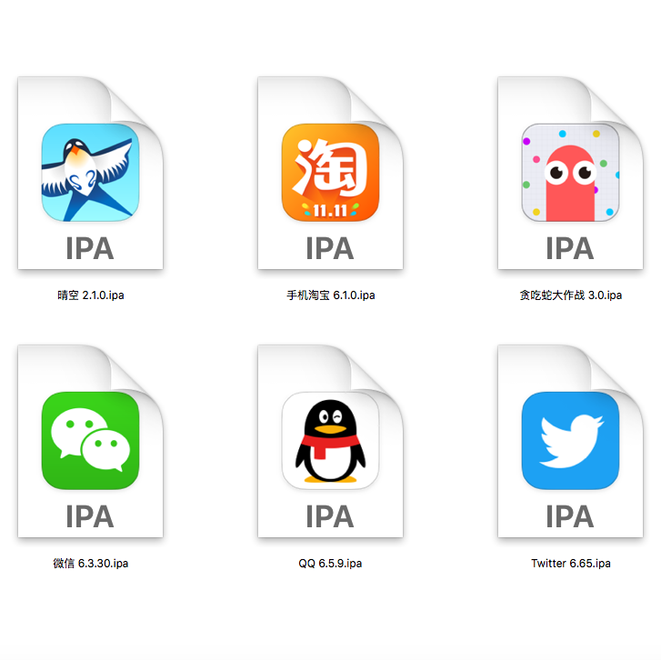
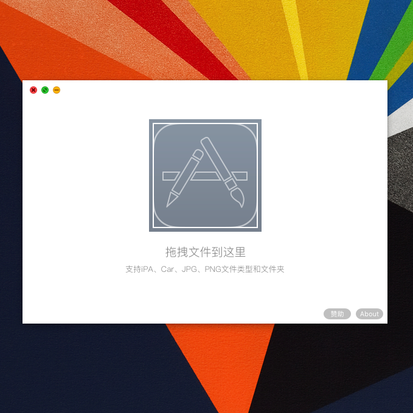
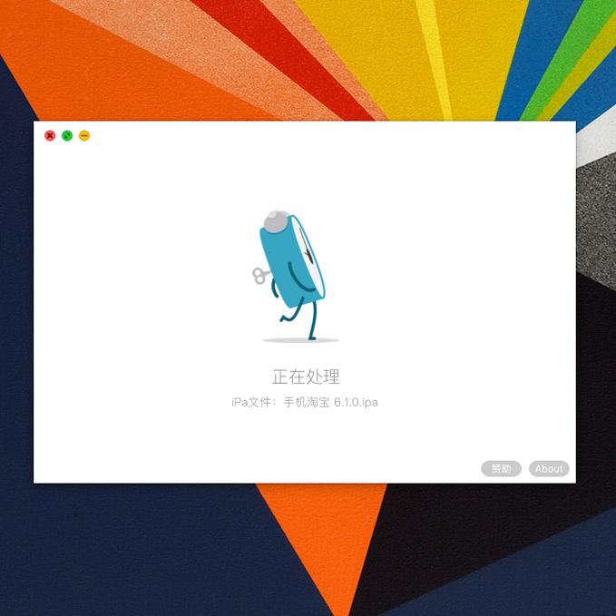
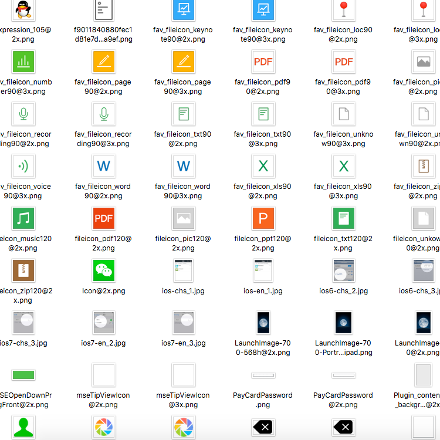
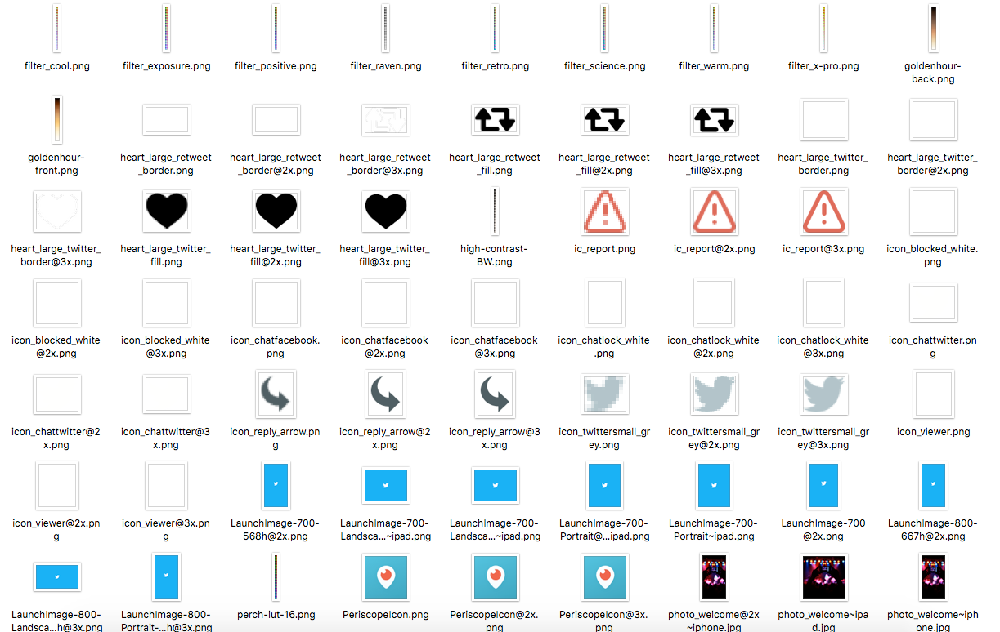

我的第一个开源项目，主要作用是提取 APP 中的 UI 素材和 Car 类型文件的图片提取。
UI设计师、个人开发者和好奇心用户的福音，只需拖放 iPa 安装包即可获取此 APP 内的 UI 图片，如希望获取微信的 UI 素材，拖放『微信.iPa』 即可。同时支持文件夹拖放及批量处理。
运行环境：OS X 10.10 及以上版本。
如果对你有帮助请在下载链接中点一下 Star，如果感觉好用欢迎分享给你的朋友～

### 开发者：

编译环境：Swift 3.0，Xcode 8.1

### 普通用户：

将下载的 Extrac.app 拖放到 Application 目录即可使用。

1. 选中要处理的 iPa、Car、JPG、PNG文件，你可以使用多选，或者将它们放在一个文件夹中，将文件拖放到 Extrac.app 中间的深色图标；
2. 等待处理完成即可；

|  |  |
| ------------------ | ------------------ |
|  |  |

#### 注意：

你可能需要开启 `系统偏好设置 -> 安全性和隐私 -> 允许从以下位置下载的应用 ->被认可的开发者/任何来源 `。

---

This is my first open source software, Its main effect is to extract the APP’s UI material.

This is a gift for UI designers, developers and curious users, you just need to drag and drop of iPa installation package, and bang! you've got this APP UI images. 

Like Twitter, rag and drop the twitter.ipa, and you got Twitter's UI pictures.

 

Also, it supports folder drag and drop and batch processing.

Operating environment: OS X 10.10 or above

### Developer:

Development environment: Swift 3.0，Xcode 8.1

### User

Drag and drop the downloaded Extrac.app into the Application directory, Done.

#### Warning

May be, you need to open`System Preferences -> Security & Privacy -> Mac App Store and identified developers or Anywhere`.

